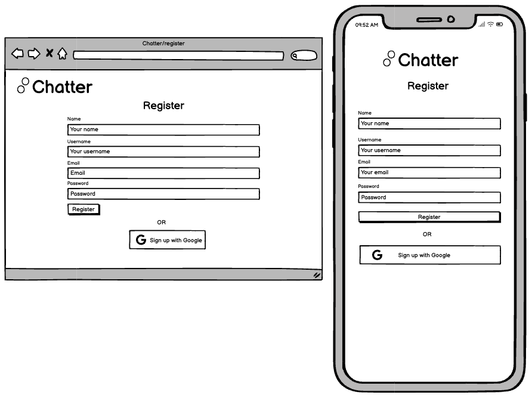
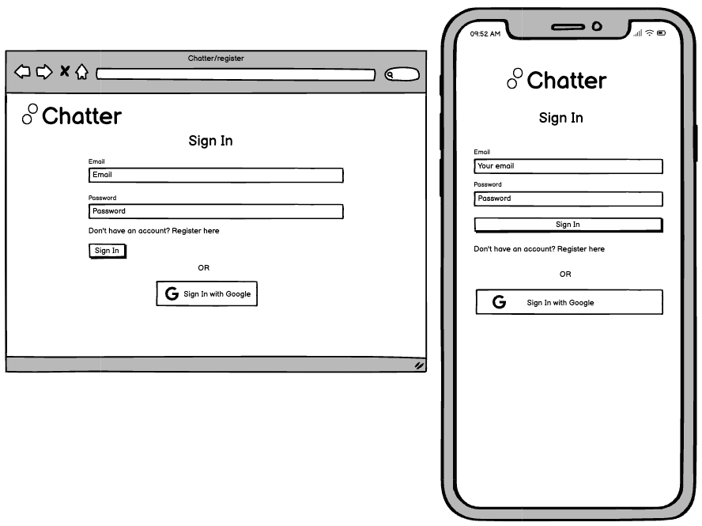

# Real time Messaging Application

Date: 17-12-2023 \
Prepared by: Brodie Hunt \
This is the client repository for the Chatter application. \
The server repository can be found here: [Server Repo](https://github.com/brodiehunt/live-messenger-server)

## Table of contents

- [Overview](#overview)
- [Environment and Setup](#2-development-environment-and-setup)
- [Tech Stack](#3-technology-stack)
- [User interface design](#4-user-interface-design)
  - [Wireframes](#41-wireframes)
  - [Screenshots](#42-screen-shots)
- [Key Features](#5-key-features)
  - [User Authentication](#51-user-authentication)
  - [Profile Management](#52-profile-management)
  - [Friends Management](#53-friends-management)
  - [Real-Time Messaging](#54-real-time-messaging-and-group-chats)
  - [Real-Time Group Chats](#55-notifications)
  - [Notifications](#56-additional-features)
- [User Stories](#6-user-stories)
- [System Architecture](#7-system-architecture)
- [Data Base](#8-database-schema)
- [Testing Strategy](#9-testing-strategy)
- [Future Enchancements](#10-future-enhancements)

## 1. Overview

**Name**: Chatter (real time messenger)

**Live Site**: [Chatter Application](https://brodie-chatter-app.netlify.app/)

**Description**: Chatter is a real-time web-based messenger application that allows users to chat instantly in groups and directly with other users. Users can manange friendships, personalize their chat settings to customize their experience, and communicate with other users with real time messaging and notifications. Chatter offers features like direct messaging, group chat messaging, friendships, real-time notification and simple login and auth with google Auth.

**Objective**: To build a user-friendly, seamless, real-time messaging platform for personal communication between friends and other users.

## 2. Development Environment and Setup

1. Clone this repository:

```
https://github.com/brodiehunt/live-messenger-client.git
```

2. Install the dependencies

```
  npm install
```

3. Set up environment variables:

- There is a text file in the root of the project named environmentVars.txt. This holds the environment variables you will need to configure to get the application working.
  1. create a .env file in the root directory.
  2. Copy the contents of the 'environmentVars.txt' file into the .env file.
  3. Add your own values to these keys. Really, to run this project in development you will only need the server url. You will need to clone and set up the server for this client. The repository for that is here: [Server Repo](https://github.com/brodiehunt/live-messenger-server)

4. Run the client application

- You can run the application in dev environment with the command:

```
npm run dev
```

## 3. Technology Stack

- **Frontend**: React, Styled-components, React Router, Context API
- **Backend**: Node.js, Express
- **Database**: MongoDB Atlas with Mongoose ORM
- **Authentication**: Passport.js - JWT and Google OAuth
- **Real-time Communication**: Socket.io
- **Testing**: Jest, SuperTest, Vitest, React-testing-library
- **Hosting**: Client: Netlify. Server: Heroku

## 4. User Interface Design

### 4.1 Wireframes






;
;
;
;

### 4.2 Screen shots


## 5. Key Features

### 5.1 User Authentication

- **Email-Based Registration and Login**: Users can Sign up or in with their email, an unique username and a secure password.
  Users who have an existing account can login with their email and password.
- **Google OAuth Integration**: A user has the option to register or sign in with their google account for convenience.
- **Password Reset Functionality**: A secure method for users to reset their password if they forget it. A token based email reset password link will be sent to the user when requested.
- **Inline Client and Server Validation**: Register and Sign up form fields are validated on both the client and server side when submitted. Form fields that fail validation will display errors helping the user correct their form submission.

### 5.2 Profile Management

- **View and Edit User Profiles**: Users can view their profile information and edit their details such as their avatar, username, email and name.
- **Edit Account settings**: Users can view and change their account settings such as their profile visibility, and whether non-friend users can message their account.
- **Avatar upload and Management**: Users can upload images for their avatar. Images are optimized and re-sized for performance before being stored.
- **Delete User Account**: Users are able to permently delete their account. This ensures all user specific data is removed from the database.

### 5.3 Friends Management

- **Friend Requests**: Users are able to recieve and send friend requests and view the status of their friend request (pending, success).
- **Viewing and Deleting Friends**: Users are able see their current friends, search for a particular friend, and delete existing friendships.
- **User Search**: Users are able to search for other registered users using their unique username. Users with certain settings will not appear in search requests.
- **People you may know suggestion**: Users will be able to see friend suggestions unique to them within a 'people you may know' section. This will be made up of people they are most likely to know based on their current friendships.

### 5.4 Real-Time Messaging and Group Chats

- **Direct Messaging**: Users will be able to create new direct messages with their friends or other users (settings dependent). Users will be able to interact in real time in these conversations with friends. Messages can be text based, images and or files.
- **Group Chats**: Users can have conversations with multiple users at the same time with Group chats. Group chats will have unique features such as group admins, the ability to assign admin roles, delete users from the conversation or remove themselves from the group.
- **Group Chat Management**: Group chats will have unique features such as group admins, the ability to assign admin roles, delete users from the conversation or remove themselves from the group. Users will be able to see all other users within the group.
- **Chat Indicators**: Users will be able to see real time chat indicators such as online status, read receipts, and typing notifications.

### 5.5 Notifications

- **Real Time Message Notifications**: Users will recieve real-time message alerts when logged into the application. This will include an icon over the conversation which has new unread messages.
- **Real time friend request notifications**: Users will recieve will time friend updates such as friend requests and notifications for accepted friend requests.
- **Real time chat indicators**: Users will be able to see real time chat indicators, such as whether users are typing or have read a sent message.

### 5.6 Additional Features

- **Conversation Search**: Users can search for their conversations based on the conversation name. Conversation names for 1-1 conversations will be the username of the other user in the conversation.
- **Friend Search**: Users can search for their friends by entering their name in a search feild or manually scrolling through a list of their friendships.
- **User Search**: Users can search for other users they are not friends with by searching for their username in a search field displaying the most relevant results to the user.

## 6. User Stories

### User Registration

**User Registration with email.** \
 As an unregistered user, I want to register for an account using my email and chosen username password, so that I can create an account and use the platform.

Acceptance Criteria:

**Scenario 1**: User correctly fills in all form fields, including a unique email, username and valid password.\
 Given that I am an unregistered user on the registration page. When I enter valid information in the registration form and click the register button, then I am registered and directed to my newly created account.

**Scenario 2:**: User enters an email or username that is already in use.\
 Given that I am an unregistered user on the registration page, when I enter an email or username that is already in use and click the register button, then I am prompted under the relevant input field to enter a different email and username because they are already in use.

**Scenario 3** User enters a password that doesn't pass the password requirements. \
 Given that I am an unregistered user on the registration page, when I fill out the register form with an invalid password and click the register button, then I am prompted under the relevant input field that my password selection is invalid and provided with information to help me choose a valid password.

**Scenario 4**: User leaves register form feilds empty.\
 Given that I am an unregistered user on the registration page, when I leave fields in the registration form empty and click the register button, then I am prompted under the relevant input field to fill in the form fields that are required to successfully submit the form and become a user.

**Scenario 5**: User is already registered. \
 Given that I am a registered user on the registration page, when I click the link 'Go to sign in', then I am taken to the sign in page.

**User Registration with google** \
 As an unregistered user, I want to register for an account using my existing my google account, so that I can quickly and easily use the platform without creating a new username and password.

Acceptance Criteria:

**Scenario 1:** Successful Registration with Google Account \
 Given that I am an unregistered user on the registration page, when I select the option to register with my Google account and complete the Google authentication process successfully, then I am registered and directed to my newly created account.

**Scenario 2:** Google Authentication denied or cancelled \
 Given that I am an unregistered user on the registration page, when i select to register with my Google account but then deny or cancel the authentication request in the Google sign-in process, then I am redirected back to the registration page with a message indicating that google sign-in was not completed.

**Scenario 3** Google Account already linked to an existing user \
 Given that I am an unregistered user on the registration page, when I attempt to register with a Google account that is already linked to an existing user on the platform, then I am notified that the Google account is already in use and given the option to log in or recover my account.

**Scenario 4** Network or Server error during Google Authentication \
 Given I am an unregistered user on the registration page, when I select to register with my Google account, but there is a network or server error during the authentication process, then I recieve an error message indication the problem and suggesting to try again later.

### User Sign In

**User Sign in with email** \
 As a registered user, I want to Sign in using my email and password, so that I can access my account.

Acceptance Criteria:

**Scenario 1:**: User enters a correct username and password. \
 Given that I am a registered user on the sign in page, when I enter the correct email and password information and click the sign in button, then I am signed in and directed to my account page.

**Scenario 2** User enters a password that doesn't pass the validation constraints. \
 Given that I am a registered user on the sign in page, when I fill out the register form with a password that fails the validation constraints, then the submit request is not sent to the server and I am prompted under the password input field that my password failed validation.

**Scenario 3** User enters incorrect email or password. \
 Given that I am a registered user on the sign in page, when I enter incorrect email and password combination and click the sign in button, then I am prompted with an error message above the form telling me my email or password is incorrect.

**Scenario 4** User is unregistered. \
 Given that I am an unregistered user on the sign in page, when I click the link 'Register here', I am redirected to the registration page.

**Scenario 4**: User leaves sign in form feilds empty. \
 Given that I am a registered user on the sign in page, when I leave fields in the sign in form empty and click the sign in button, then I am prompted under the relevant input field to fill in the form fields that are required to successfully submit the form and access my account.

**User Sign in with Google Account**\
 As a registered user, I want to sign in to my account using my google account, so that I can quickly and easily use the platform.

Acceptance Criteria:

**Scenario 1:** Successful Sign in with Google Account. \
 Given that I am a registered user on the sign in page, when I select the option to sign in with my Google account and complete the Google authentication process successfully, then I am directed to my account.

**Scenario 2:** Google Authentication denied or cancelled. \
 Given that I am registered user on the sign in page, when i select to sign in with my Google account but then deny or cancel the authentication request in the Google sign-in process, then I am redirected back to the sign in page with a message indicating that google sign-in was not completed.

**Scenario 3** Network or Server error during Google Authentication. \
 Given I am a registered user on the sign in page, when I select to sign in with my Google account, but there is a network or server error during the authentication process, then I recieve an error message indication the problem and suggesting to try again later.

**User Forgot their account password**\
 As a registered user, I want to reset my password, so I am able to access my account.

Acceptence criteria:

**Scenario 1:** Moved to the reset password page. \
 Given that I am a registered user on the sign in page, when I select the 'forgot my password' link, I am taken to a password retrieval page where I enter my email so I can reset my password.

**Scenario 2:** Valid email entered into the password reset form. \
 Given that I am a registered user on the password reset page, when I the email of a valid user, I recieve a success message telling my to check my email and follow the steps provided there.

**Scenario 3:** invalid email entered into the password reset form. \
 Given that I am a registered user on the password reset page, when I the email of a valid user, I recieve an error message telling me that the email I provided isn't a valid email.

### Profile Management

**User can view their profile information and settings.**\
 As a registered user, I want to view my profile information and account settings, so that I know what my profile and account settings are.

Acceptance criteria:

**Scenario 1:** Successful viewing of profile info. \
 Given that I am a registered user, when I navigate to the account page, then I am displayed the correct user account information and settings.

**Scenario 2:** Network or server error on profile information retrieval. \
 Given that I am a registered user, when I navigate to the account page, but there is a network or server error, then I am shown an error message at the top of the page to inform me of the error and to try again later.

**User can update their profile information and settings.**\
 As a registered user, I want to update my profile information and account settings, so that my profile is correct and personalised to my desire.

Acceptance criteria:

**Scenario 1:** Successful update of users personal avatar. \
 Given that I am a registered user on the account page, when I upload an avatar image and click the 'save' button, then my avatar image is updated in the profile and throughout the application.

**Scenario 2:** Unsuccessful update of users personal avatar. \
 Given that I am a registered user on the account page, when I upload an avatar image and click the 'save' button but their is an error, then my avatar image is not updated and I am prompted with a message telling me why.

**Scenario 3:** Successful email and username update. \
 Given I am a registered user on the account settings page, when I change my email and username and click the 'save' button, then my email and username are successfully updated, and I receive a confirmation message.

**Scenario 4:** Unsuccessful email or username update due to invalid feilds. \
 Given I am a registered user on the account settings page, when I enter invalid information in the email or username fields and click the 'save' button, then the update is not processed, and I am shown a message indicating the invalid fields and suggestions for correction.

**Scenario 5:** Unsuccessful email or username update of non-unique feilds (already exist). \
 Given I am a registered user on the account settings page, when I enter an email or username that is already in use by another account and click the 'save' button, then my email or username is not updated, and I am informed that the email or username is already in use.

**Scenario 6:** Unsuccessful email or username update due to network or server error. \
 Given I am a registered user on the account settings page, when I attempt to update my email or username and a network or server error occurs, then the update is not completed, and I am shown an error message suggesting to try again later.

### Friendships

**User can search for other users to add as friends.**\
 As a registered user, I want to search for users to add as friends, so that I can easily communicate with them on the app.

Acceptance criteria:

**Scenario 1:** Successful Search with Relevant Results. \
 Given I am a registered user using the search feature, when I enter a username in the search bar and submit the search, then I am presented with a list of the most relevant user results based on the username input.

**Scenario 2:** Search with No Results. \
 Given I am a registered user using the search feature, when I enter a username that does not match any user in the system, then I receive a message indicating that no users were found matching my search criteria.

**Scenario 3:** Search with Partial Username Match. \
 Given I am a registered user using the search feature, when I enter a partial username that matches several users, then I am presented with a list of users whose usernames partially match the input, sorted by relevance.

**Scenario 4:** Unsuccessful Search Due to Network or Server Error. \
 Given I am a registered user using the search feature, when I submit a search and a network or server error occurs, then I receive an error message indicating that the search could not be completed and suggesting to try again later.

**Scenario 5:** Search Input Left Blank. \
 Given I am a registered user using the search feature, when I attempt to submit a search without entering any username, then I am prompted to enter a username before the search can be executed.

**Scenario 6:** Search with Special Characters or Invalid Input. \
 Given I am a registered user using the search feature, when I enter a username with special characters or invalid format, then I am informed that the input is invalid and given guidance on acceptable username formats.

**User can request and accept each others friendships.**\
 As a registered user, I want to request another user for friendship, accept their friendship request, or deny their friendship request, so that I can effectively manage the people I want to communicate with.

Accepted criteria:

**Scenario 1:** Successfully sending a friendship request. \
 Given I am a registered user on the platform, when I search for another user and send them a friendship request, then the request is sent to that user, and I see a confirmation that the request has been sent.

**Scenario 2:** Unsuccessfully sending a friendship request. \
 Given I am a registered user on the platform, when I search for another user and send them a friendship request, but there is a server or network error, then the request is not sent to that user, and I see an error message that the request was unsuccessful and to try again later.

**Scenario 3:** Accepting a friendship request. \
 Given I have received a friendship request from another user, when I choose to accept the request, then the user is added to my friends list, and both of us receive a confirmation of the new friendship.

**Scenario 4:** Denying a friendship request. \
 Given I have received a friendship request from another user, when I choose to deny the request, then the request is removed, and the user is not added to my friends list. Neither party receives any further notifications about this particular request.

**Scenario 5:** Viewing received friendship requests. \
 Given I am on my notifications page, when I have pending friendship requests, then I can view all pending requests and choose to accept or deny each one.

**Scenario 6:** Cancelling a sent friendship request. \
 Given I have previously sent a friendship request to a user, when I choose to cancel this request before it’s accepted or denied, then the request is withdrawn, and it no longer appears in the pending requests of the recipient user.

**Scenario 7:** Receiving a Notification of a Friendship Request. \
 Given another user sends me a friendship request, when I am currently logged in or the next time I log in, then I receive a notification alerting me to the new friendship request.

### Messaging

**User can create a new conversation and send a message**\
 As a registered user, I want to create a new conversation with an existing friend, so that I can communicate with them via live messages.

Acceptance Criteria:

**Scenario 1:** Creating a new conversation and sending the first message. \
 Given I have clicked the new message button, when I type an existing friends name into the search bar, and type a message into the text field and click 'send', then a conversation will be started between me and that friend and they will recieve a notification of my message.

**Scenario 2:** Sending a message within a conversation. \
 Given that I am viewing a single conversation, when I type a message into the message input feild an click send, then the message appears in the conversation immediately, and the other user is notified of the message.

**Scenario 3:** Unsuccessfully sending a message within a conversation. \
 Given that I am viewing a single conversation, when I type a message into the message input field and click send, but there is a server or network error, then the message is added to the conversation, but is highlighted to show it hasn't been sent successfully and to try again.

**User can enter an existing conversation with a friend**\
 As a registered user, I want to send a message in an existing conversation with a friend, so that I can continue my conversation with that friend

Acceptance Criteria

### Group Chats

### Indicators

## 8. Database Schema

User:

```
  const UserSchema = new Schema(
  {
    googleId: {
      type: String,
      unique: true,
      sparse: true, // Mongodb will only index docs where googleId exists
    },
    username: {
      type: String,
      required: true,
      unique: true,
      index: true,
    },
    email: {
      type: String,
      required: true,
      unique: true,
      index: true,
    },
    name: {
      type: String,
    },
    avatarUrl: {
      type: String,
      default: "/user.png",
    },
    password: {
      type: String,
      select: false, // by default will not be returned from queries.
    },
    passwordResetToken: {
      expires: {
        type: Date,
      },
      token: {
        type: String,
      },
    },
    accountSettings: {
      isPrivate: {
        type: Boolean,
        default: false,
      },
      allowNonFriendMessages: {
        type: Boolean,
        default: true,
      },
      readReceipts: {
        type: Boolean,
        default: true,
      },
    },
    newRequests: {
      type: Number,
      default: 0,
      required: true,
    },
  },
  { timestamps: true }
);
```

Friendship:

```
  const FriendshipSchema = new Schema(
  {
    users: [
      {
        type: mongoose.Schema.Types.ObjectId,
        ref: "User",
      },
    ],
    requestUser: {
      type: mongoose.Schema.Types.ObjectId,
      ref: "User",
    },
    accepted: {
      type: Boolean,
      required: true,
      default: false,
    },
  },
  { timestamps: true }
);
```

Conversation:

```
const ConversationSchema = new Schema(
  {
    participants: [
      {
        type: mongoose.Schema.Types.ObjectId,
        ref: "User",
      },
    ],
    isGroupChat: {
      type: Boolean,
    },
    groupMetaData: {
      groupName: {
        type: String,
      },
      groupAdmins: [
        {
          type: mongoose.Schema.Types.ObjectId,
          ref: "User",
        },
      ],
    },
    messages: [
      {
        type: mongoose.Schema.Types.ObjectId,
        ref: "Message",
      },
    ],
    lastMessage: MessageSchema,
    readBy: [
      {
        userId: {
          type: mongoose.Schema.Types.ObjectId,
          required: true,
        },
        username: {
          type: String,
          required: true,
        },
      },
    ],
  },
  { timestamps: true }
);
```

Message:

```
const MessageSchema = new Schema(
  {
    conversationId: {
      type: mongoose.Schema.Types.ObjectId,
      ref: "Conversation",
    },
    sender: {
      type: mongoose.Schema.Types.ObjectId,
      ref: "User",
      required: true,
    },
    senderName: {
      type: String,
      required: true,
    },
    content: {
      type: String,
      required: true,
    },
    messageType: {
      type: String,
      required: true,
      default: "text",
    },
  },
  { timestamps: true }
);
```

## 9. Testing Strategy

TBA

## 10. Future Enhancements

### Avatar Img Upload

-Users will be able to upload and edit their own avatar imgs, rather than just have the default one currently provided.

### Group chat admin roles and Management

- Users will be able to manage the groups that they are included in (view and leave);
- Users will be able to assign roles with differing control over the group (admins). Have the ability to remove users, and add other users into existing groups.

**Video Chat Functionality**:
